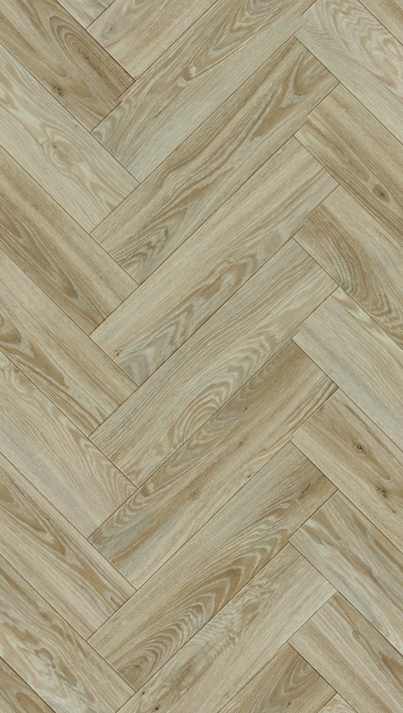
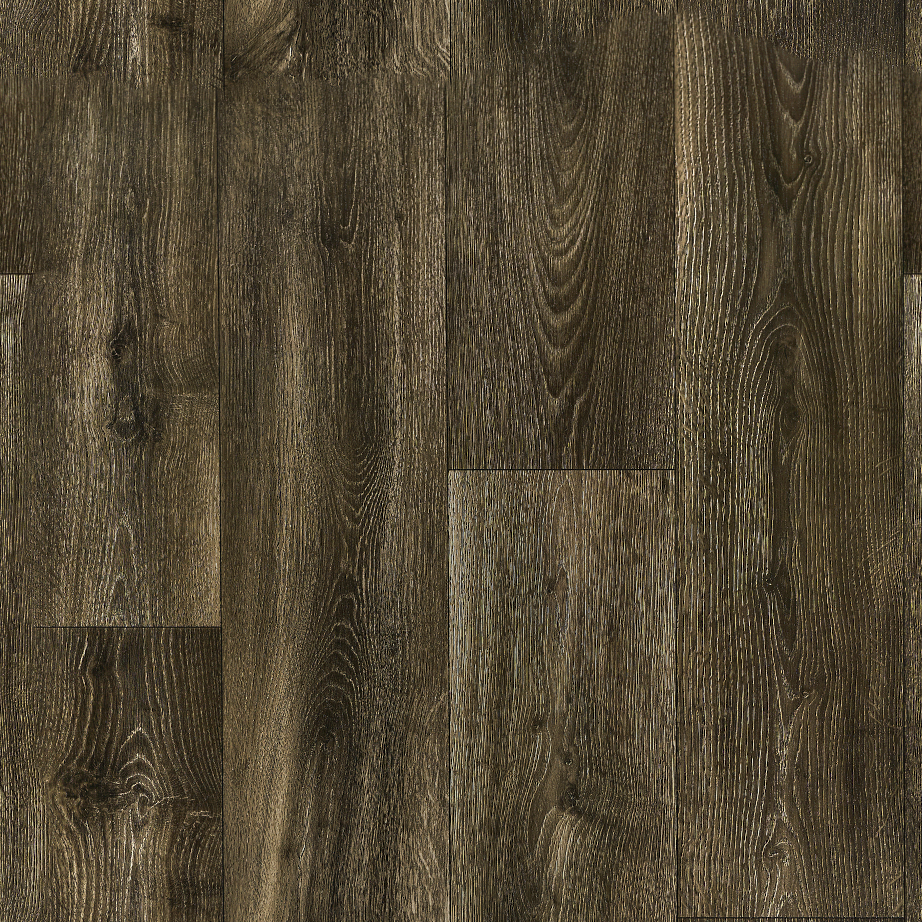

# Seamless Texture Generator

Автоматическое превращение фотографии текстуры (плитка, доски, паркет-«ёлочка») в
**бесшовную тайлящуюся текстуру**. Закинул картинку — получил тайл, который
раскладывается с любым числом повторов **без видимых стыков, без обрезанных/смазанных
досок, с сохранением размера плашек и без цветных расхождений**. Без ручного
редактирования.

```bash
pip install -r requirements.txt
python cli.py texture.png                 # -> texture_seamless.png
python cli.py texture.png --tile 2        # ещё и превью раскладки 2x2
python cli.py texture.png --method lattice # форсировать конкретный метод
```

---

## Результаты

Слева направо: **вход → seamless-тайл → раскладка 2×2**.

| Текстура | Метод | Размер тайла | seam_score\* |
|---|---|---|---|
| Камень (плитка) | `grid` | 1677×1677 | 1.77 |
| Ёлочка (паркет) | `lattice` | 887×1568 | 1.05 |
| Тёмное дерево | `mincut` | 922×922 | 1.34 |
| Светлое дерево | `mincut` | 1800×1800 | 1.04 |

\* `seam_score` — отношение среднего градиента **поперёк стыка** к среднему градиенту
**внутри** тайла (≈1.0 → шов статистически неотличим от обычного перепада текстуры).
Для сеток метрика завышена самими линиями затирки — там результат оценивается глазами.






Полноразмерные seamless-тайлы и раскладки 2×2 — в `examples/results/`.

---

## Как это запускалось

```cmd
python cli.py examples\inputs\grey_wood.png   -o examples\results\grey_wood_seamless.png   --tile 2

python cli.py examples\inputs\dark_wood.png   -o examples\results\dark_wood_seamless.png   --tile 2

python cli.py examples\inputs\stone_grid.png  -o examples\results\stone_grid_seamless.png  --method grid    --tile 2

python cli.py examples\inputs\herringbone.png -o examples\results\herringbone_seamless.png --method lattice --tile 2
```

Дерево распознаётся автоматически (`auto` → `mincut`); для плитки и ёлочки метод задан явно, чтобы не зависеть от порога авто-детекции.

---

## Ключевая идея

У реальных фото-текстур есть **геометрический период раскладки** (шаг затирки, шаг
досок, повтор «ёлочки»), но **содержимое не повторяется** — каждая плитка/доска
уникальна. Поэтому резать в лоб по среднему периоду нельзя. Пайплайн распознаёт тип
текстуры и режет **по реальной структуре**, своим методом для каждого случая. Общий
для всех препроцесс — выравнивание яркости и цвета.

---

## Методы в коде

### 0. Препроцесс для всех — `flatten_illumination`
Выравнивание **яркости и цвета** (flat-field). Яркость делится на сильно размытую
яркость (убирает виньетку/градиент); в Lab из каналов a/b вычитается низкочастотный
перекос (убирает тёплый/серый разнотон по полю — главную причину цветных расхождений
на стыке). Локальная разнотонность отдельных плашек сохраняется.
Параметры: `sigma_frac` (масштаб «крупного» градиента), `strength`, `chroma`.

### 1. `grid` — регулярная сетка (плитка) → `detect_grid` + `grid_crop`
- **Детекция:** ищем линии затирки как пики проекции градиента по каждой оси;
  считаем текстуру сеткой, только если шаг стабилен (CV < 0.08) на **обеих** осях.
- **Кроп:** режем на целое число ячеек так, чтобы **стык тайлов попадал в середину
  плитки** (на ровную поверхность), а не на затирку. Тогда все кресты затирки —
  внутренние и идеально ровные, а плитки строго одного размера. Блендинг не нужен.

### 2. `lattice` — диагональная решётка (ёлочка / паркет) → `detect_lattice` + `rectify_perspective` + `make_tileable_lattice`
- **Период по карте кромок** (`detect_lattice`): геометрия планок периодична, даже
  если текстура дерева — нет. Находим период по нормированной автокорреляции карты
  кромок на обеих осях и **уточняем до субпикселя** (иначе ошибка округления копится
  по периодам и планки «едут»).
- **Выпрямление перспективы** (`rectify_perspective`, `rectify=True`): в реальном фото
  шаг планки слегка «едет» вдоль кадра (перспектива/наклон). Меряем локальный период
  в нескольких окнах, линейной моделью описываем дрейф и **ресемплим так, чтобы шаг
  стал постоянным** — иначе никакой прямоугольный кроп не стыкуется, и планки не
  попадают друг в друга.
- **Тайл** (`make_tileable_lattice`): кроп до целого числа периодов **+ ресемпл до
  ровно целого периода** (тайл строго периодичен, не «едет» при любом числе повторов),
  затем сшивка краёв с перекрытием **ровно в один период** — геометрия по обе стороны
  совпадает, поэтому min-cut + Laplacian примиряют **только тон**, не ломая форму
  планок. (Обычный min-cut здесь не годится — режет диагональные планки поперёк.)

### 3. `mincut` — стохастика (доски случайной ширины) → `make_tileable_overlap`
Периода нет, поэтому сшиваем края по **шву минимальной ошибки** (*Image Quilting*,
Efros & Freeman, 2001): шов идёт вдоль кромок досок/волокон, доски не режутся.
**Laplacian-блендинг** сшивает низкие частоты широко (цвет/тон → скачок исчезает),
высокие — узко по шву (структура резкая, без смазывания).

### Диспетчер — `make_seamless(img, method='auto', rectify=True)`
Авто-порядок: сетка → решётка → min-cut. Любой метод можно форсировать
(`--method grid|lattice|mincut`). `seam_score` — объективная метрика бесшовности.

---

## Параметры для тонкой настройки

| Параметр | Где | Зачем |
|---|---|---|
| `rectify=True/False` | `make_seamless` | выпрямление перспективы для ёлочки (если планки «не попадают»). |
| `detect_lattice(ds=…)` | решётка | даунсемпл грубого поиска периода (меньше = точнее, медленнее). |
| `detect_lattice(thresh=…)` | решётка | порог «это решётка» (0.40). Ниже — если ёлочку не распознало. |
| `make_tileable_lattice(max_periods=N)` | решётка | число периодов в тайле (меньше = меньше остатка перспективы, но больше повтор). |
| `make_tileable_overlap(ov_frac=…)` | доски | ширина перекрытия для min-cut. |
| `flatten_illumination(chroma=…, strength=…)` | препроцесс | сила выравнивания цвета/яркости. |

---

## Сильные и слабые стороны

**Сильные:** точный размер ячеек/планок; на ёлочке планки целые, форма не искажается;
ровные яркость и цвет (нет полос и тёплый/серый скачков); ровные кресты затирки на
плитке; выпрямление лёгкой перспективы; сохранение вида/разрешения; авто-выбор метода.

**Слабые:**
- **Повтор содержимого.** Один тайл при больших раскладках повторяется (это не шов —
  природа любого одиночного тайла). Решается синтезом полотна N×N из нескольких кропов.
- На **досках** остаётся неизбежный геометрический стык (две разные доски не совпадают
  кромка-в-кромку); цвет выровнен, форму до идеала тем же приёмом не довести.
- Выходной размер меньше входа на ширину перекрытия (для min-cut/решётки).
- **Сильная/нелинейная перспектива** линейной моделью не выпрямляется полностью —
  лучше снимать текстуру фронтально или выпрямлять гомографией до пайплайна.

---

## Структура

```
seamless.py   # ядро: flat-field, 3 метода (grid / lattice / mincut), детекторы, метрика
cli.py        # закинул картинку -> seamless (--tile, --method)
examples/inputs/   # исходные текстуры
examples/results/  # *_seamless.png, *_seamless_tiled2x2.png
```
